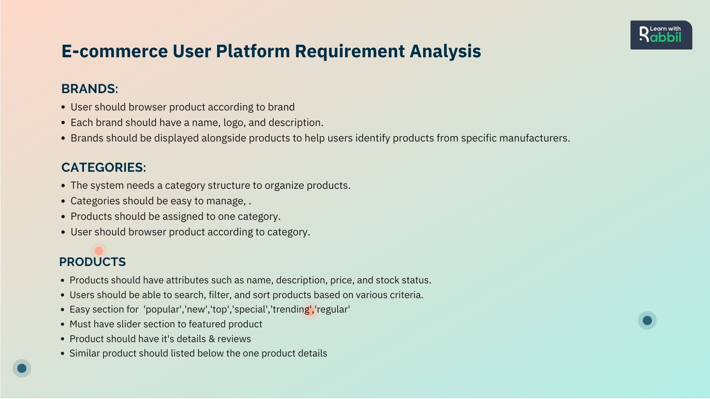
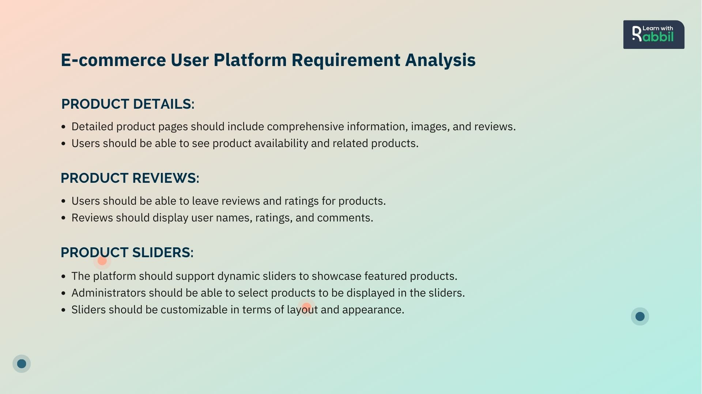
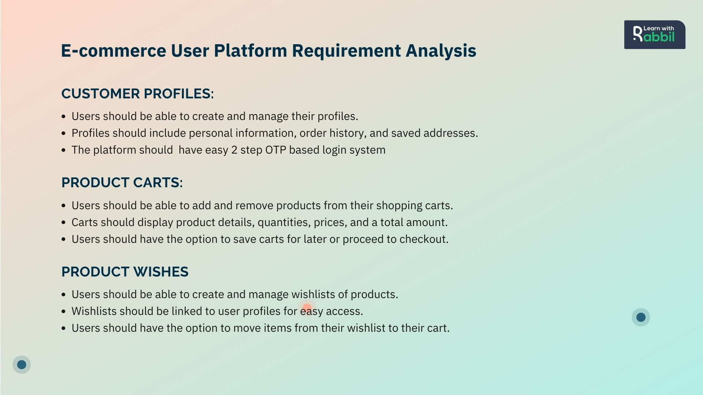
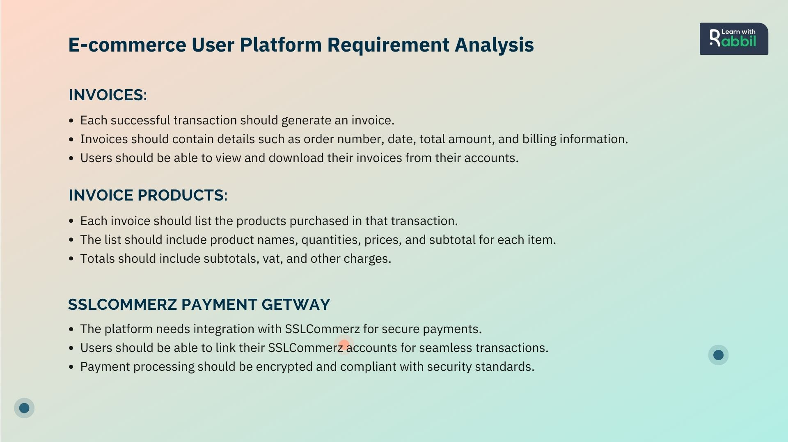
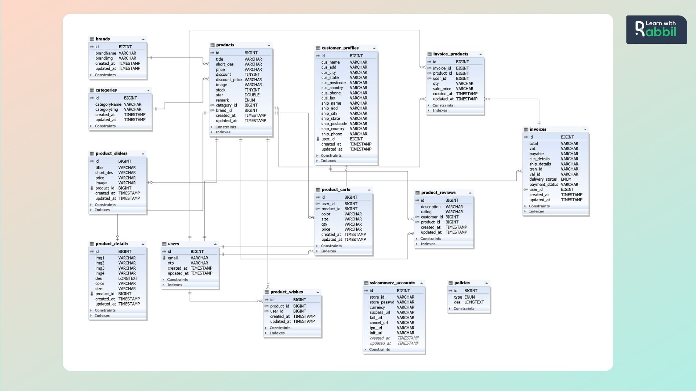
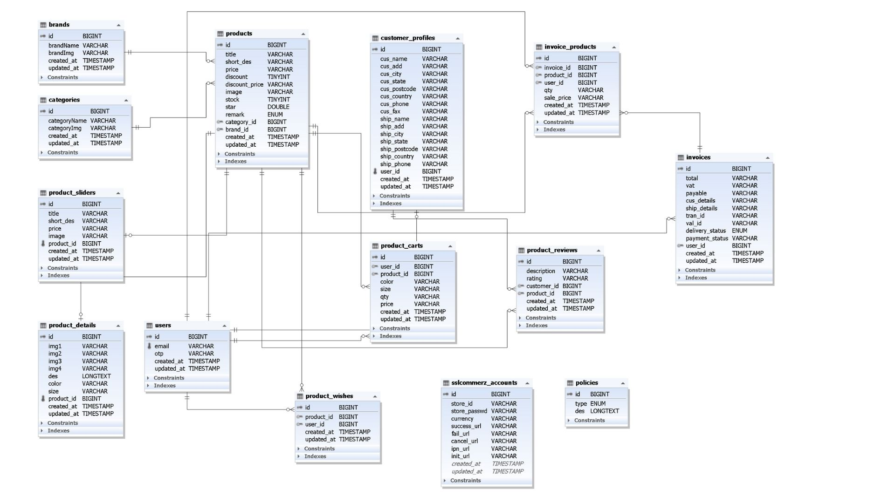
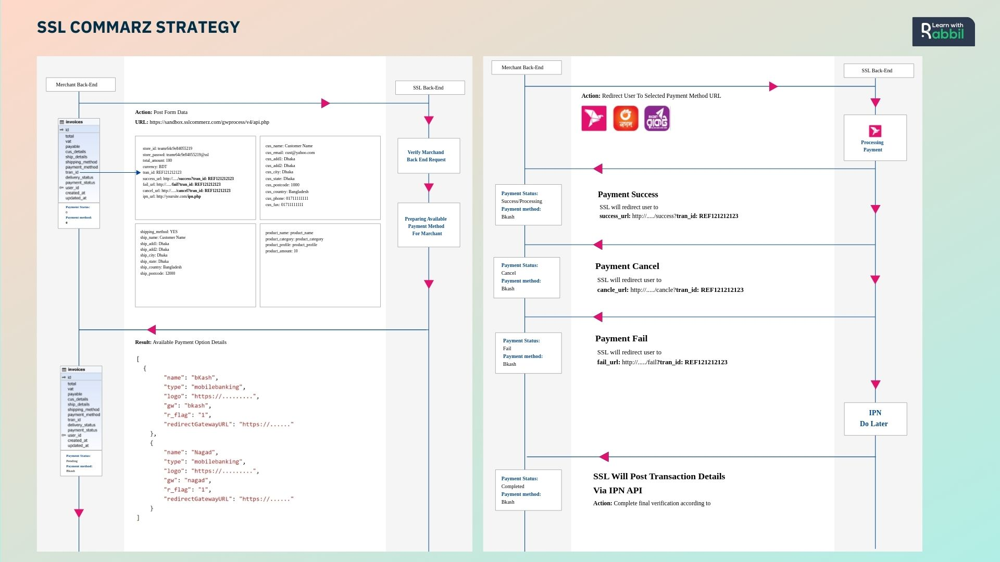
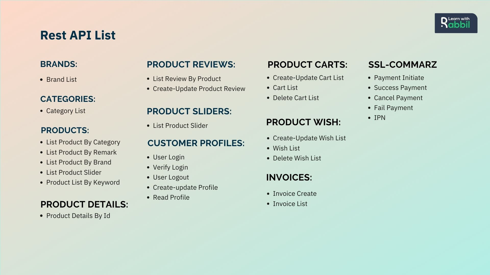

# Ecommerce API Documentation

This API provides endpoints to manage e-commerce functionalities such as products, orders, and users.
You can find the full API documentation on Postman here:

# How to Use This API
- For Flutter, Java, or Kotlin application development.
- Ideal for self-practice, assignments, or demo projects.
- Compatible with React for front-end development.
- Can be integrated with Next.js for server-side rendering applications.
- Suitable for Vue.js front-end development.
- Usable with React Native for mobile application development.
- Ideal for API SQA practice & testing 
- Ideal for B2B & B2C practice 

